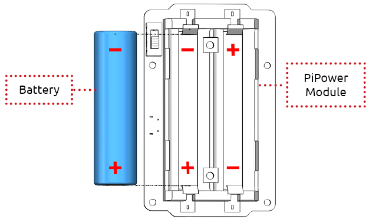
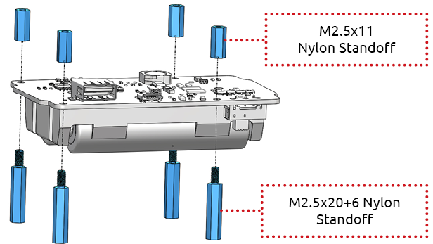
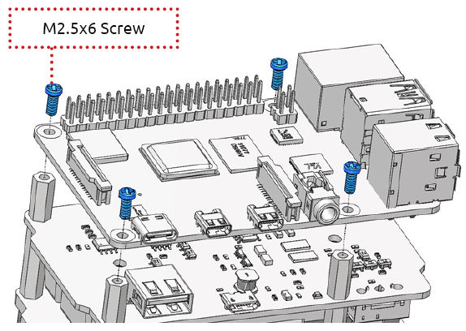
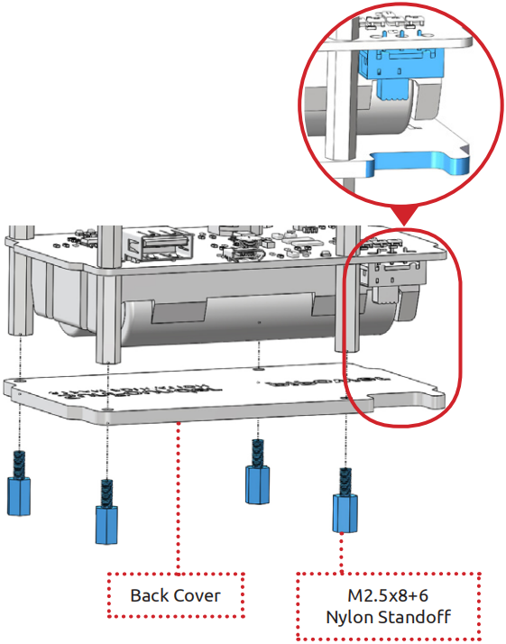
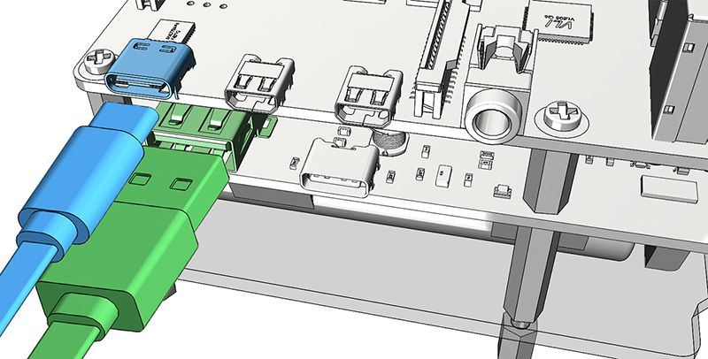
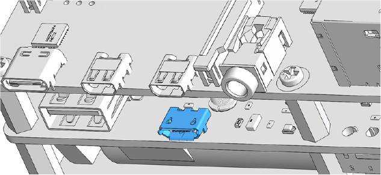

Assemble the PiPower
=======================

After getting familiar with the components in the 
package, we start to assemble PiPower.

In the next steps, there are a lot of details you need to 
notice, especially the assembly position of the battery 
and the clear acrylic back cover.

**Place the Batterries**

You can place the battery according to it: anode to anode; cathode to cathode.

**Assemble the PiPower Module**

**Assemble the Raspberry Pi**

**Assemble the Back Cover**

Put the gap side of acrylic back cover under the switch of PiPower module so that you can easily power the PiPower on/off.

**Plug the USB Cable**

When the battery is about to be run out, you can charge the battery through the Type-C USB port of the PiPower module.

