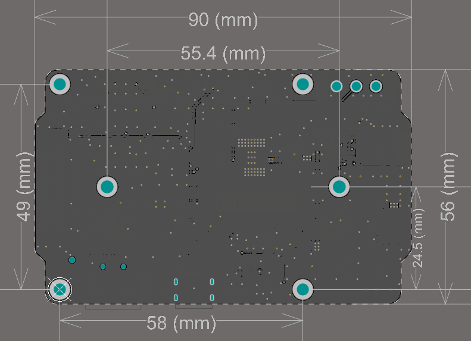

Features
===============

* Pass through Charging
* Output: USB Type-A, 5V/3A
* Input: USB Type-C, 5V/2A
* Power Switch
* 1 Charge Indicator
* 4 Battery Indicators
* Dimension: 90mm x 60mm x 24.9mm
* Battery: 2 x 3.7V 18650 lithium battery (Self-provided)
* Over Discharge Protection Voltage: 3.2V
* Overcharge Protection Voltage: 4.2V

**Interfaces**

.. image:: img/media2.png

**Over-discharge Protection**

When the single battery voltage is below 3.2V, the battery protection activates and the battery is no longer discharged.

When the battery is unplugged, due to the mechanism of the on-board over-discharge protection circuit, the voltage will be considered too low, thus activating the protection circuit; when you replug the battery into the PiPower, the battery will not work properly, at this time, you need to plug the Tyep C cable into the charging port to turn off the protection circuit, and the battery can be used normally.

**Overcharge Protection**

Charging ends when the total battery voltage reaches 8.4V.

**Charge Balance**

When a single battery exceeds 4.2V, the voltage divider resistor channel conducts and the battery charging current is reduced or even discharged. 
It is recommended to use the same type of battery with similar voltage for both batteries.

**Battery Indicators**

The relationship between the battery indicators and voltage is as follows:

* 4 LEDs all on: voltage > 7.8V
* 3 LEDs on: voltage > 7.44V
* 2 LEDs on: voltage >7.04V
* 1 LED on: voltage > 6.68V
* 4 LEDs all off: voltage <6.68V，at this time，batteries need to be charged.

**Temperature**

When the output power reaches the maximum nominal 5V/3A, the temperature of DC-DC buck chip U1 will rise to about 70-80 degrees Celsius, so be careful not to touch it to prevent burns and keep ventilation. When the temperature reaches the DC-DC protection temperature of 75 degrees Celsius, the DC-DC will shut down to prevent overheating damage.

Downloads
============

**Dimensional Drawing**

* `Datasheet <https://github.com/sunfounder/sf-pdf/raw/master/schematic/pipower.pdf>`_ of the main components on PiPower
* `Schematic <https://github.com/sunfounder/sf-pdf/tree/master/datasheet/pipower>`_
* `3D Model(.step) <https://github.com/sunfounder/sf-pdf/raw/master/3d_model/pipower.step>`_

