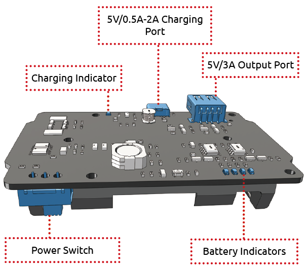
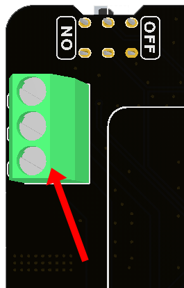
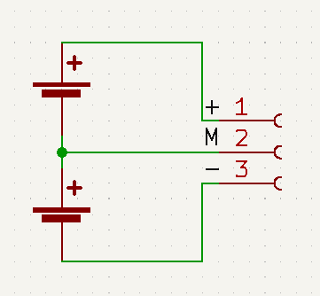
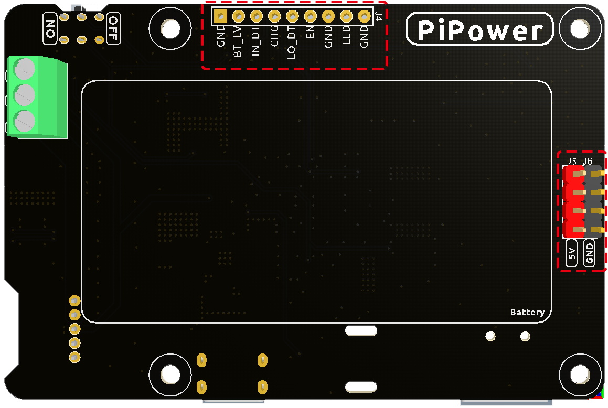

機能一覧
===============

* パススルー充電
* 待機電流：< 0.5mA
* 入力:
    * USB Type-C, 5V/3A
    * バッテリー入力
* 出力：
    * USB Type-A, 5V/3A
    * 2x4P P2.54ピンヘッダー

* 充電電力：7.4V/1A 7.4W
* 搭載バッテリー
    * タイプ：3.7V リチウムイオンバッテリー x 2
    * 容量：2000mAh
    * コネクタ：PH2.0, 5P
* 過放電保護電圧：3.2V
* 過充電保護電圧：4.2V
* 寸法：90mm x 60mm x 24.9mm
* オンボードインジケーター
    * 1 x 充電インジケーター (CHG)
    * 1 x 電源インジケーター (PWR)
    * 4 x バッテリーインジケーター (D4 ~ D7)

充電と放電について
------------------------------------

**電源パスの切り替え**

PiPower V2は統合電源機能を有し、バッテリー消費を抑えるために自動で電源パスを切り替えます。

* 外部電源が接続されている場合、5V出力は外部電源から直接出力され、電源スイッチでオン/オフが可能です。さらに、外部電源で低電流でバッテリーを充電できます。
* 外部電源が抜かれた場合、PiPowerはバッテリー降圧供給に切り替わり、デバイスを保護するためにシームレスに切り替えます。

**充電電力**

電源スイッチの状態に応じて充電電流が切り替わります。

* 電源スイッチがオフの場合、PiPowerは外部デバイスに電源を供給しません。この時点で、充電電力は7Wで、0%から100%まで充電するのに約2時間かかります。
* 電源スイッチがオンの場合、外部電源は接続されたデバイスに直接電源を供給します。この時、充電電力は1W以下に減少して、電源供給電流を確保します。

**過放電保護**

単一バッテリーの電圧が3.2V以下になると、バッテリー保護が作動し、バッテリーはこれ以上放電されません。

バッテリーが外れた場合、オンボードの過放電保護回路のメカニズムにより、電圧が低すぎると判断され、保護回路が作動します。この状態でPiPowerにバッテリーを再接続すると、バッテリーは正常に動作しないため、Type Cケーブルを充電ポートに接続して保護回路を解除し、バッテリーを正常に使用できるようにする必要があります。

**過充電保護**

バッテリーの合計電圧が8.4Vに達した場合、充電が終了します。

**充電バランス**

単一バッテリーが4.2Vを超えた場合、電圧分割抵抗器チャンネルが導通し、バッテリーの充電電流が減少または放電されます。

**温度**

出力電力が最大定格の5V/3Aに達すると、DC-DC降圧チップU1の温度は約70-80度Cに上昇するので、触らないように注意し、通気を確保してください。温度がDC-DCの保護温度である75度Cに達すると、DC-DCは過熱損傷を防ぐためにシャットダウンします。

バッテリーインジケーター
--------------------------

バッテリーインジケーターと電圧との関係は以下の通りです：

* 4つのLEDがすべて点灯：電圧 > 7.8V
* 3つのLEDが点灯：電圧 > 7.36V
* 2つのLEDが点灯：電圧 >6.96V
* 1つのLEDが点灯：電圧 > 6.6V
* 4つのLEDがすべて消灯：電圧 <6.6V、この時点で、バッテリーを充電する必要があります。

外部バッテリー
--------------------------

ネジ端子を使用して独自のバッテリーを接続できます。

.. warning:: 外部バッテリーと同梱のバッテリーを同時に接続しないでください！

外部バッテリーは、3.7Vのリチウムバッテリーを2つ直列接続したもののみをサポートします。インターフェイスには「+」「M」「-」の3つのピンがあります。それぞれ、バッテリーの正極、二つのバッテリーの中間、およびバッテリーの負極に接続する必要があります。

PiPowerボードにはオンボードのバッテリー保護回路があり、過放電、過充電、過電流保護を提供しています。そのため、独自の保護ボードを持つバッテリーを使用しないことが推奨されています。

「M」インターフェイスは主に、単一セルバッテリー保護および充電中のバランス充電電流のためのボードの保護回路に使用されます。保護機能やバランス充電機能が不要な場合、この「M」インターフェイスに接続する必要はありません。

IOピンについて
-----------------

PiPowerには、お客様のDIYニーズに応えるために複数の信号ピンが提供されていますが、デフォルトでははんだ付けされていません。

* **GND**: アース入力
* **BT_LV**: バッテリー電圧取得ピン。このピンの電圧は、バッテリー電圧の1/3に等しい。
* **IN_DT**: 入力検出ピン。USB電源入力があるかどうかを判断するために使用され、存在する場合、このピンは高電圧を出力する。
* **CHG**: 充電状態指示ピン。このピンは充電中に高い。
* **LO_DT**: バッテリー低電圧状態ピン。通常状態では、このピンは低い。低電圧が検出された場合、このピンは高い。
* **EN**: スイッチ信号ピン。ENピンは外部スイッチに接続可能で、このピンを接地すると、PiPowerがオフになります。外部スイッチは自己回復ボタンやキーなどを使用できません。ENピンは、オンボードスイッチがオンのときのみ有効です。
* **GND**: アース入力
* **LED**: 電源インジケーターピン。電源投入時に5Vを出力する。外部LEDを接続する際は、間に電流制限抵抗を追加する必要があります。
* **GND**: アース入力

バッテリーについて
----------------------

.. image:: img/2battery.jpg
    :width: 300
    :align: center

* **VCC**: バッテリー正極。こちらにはVCCとGNDの2セットがあり、電流を増加させて抵抗を減らすためです。
* **Middle**: 二つのセル間の電圧をバランスさせ、バッテリーを保護します。
* **GND**: バッテリー負極。

このバッテリーパックは、SunFounderによってカスタム製造されたもので、3.7V 18650バッテリーを2つ含んでおり、容量は2200mAhです。コネクタはPH2.0-5Pで、PiPowerに挿入した後、直接充電できます。

