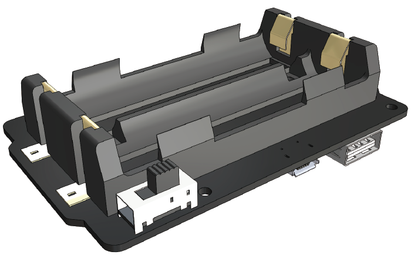

PiPower - Raspberry Pi UPS with Battery
=============================================

**What a UPS Does?**

If your Raspberry Pi project requires constant power, relying only on the main power system is not a viable option. Depending on your location, power drops and surges may occur frequently and often last for hours. Any power fluctuations can damage your Raspberry Pi, and a power outage will immediately shut it down. Consequently, it will not shut down safely, which can result in all data on the SD card being lost, increasing the chances of it being destroyed.

Therefore, the use of an uninterruptible power supply (UPS) is recommended.

With a UPS, if there is a power interruption from the mains (interruption = power outage), the battery or other power source will take over and continue to power the device without shutting it down. A UPS is often considered an emergency power source. After the main power source is repaired, the UPS will recharge and be ready to handle the next disaster.

**About PiPower**

That's why we designed PiPower in the first place. PiPower can be used as a second power source for the Raspberry Pi. A USB-C mains power supply plugged into the PiPower will directly power the Raspberry Pi and charge the battery at low current. PiPower can seamlessly power up a Raspberry Pi in the event of a power outage or disconnection of USB-C mains power.

PiPower can output 5V/3A power supply to meet various Raspberry Pi usage situation. 
It has 4 power indicators; each indicator represents 25% of the power, and is equipped with a power switch to turn on/off the power of the Raspberry Pi without plugging or unplugging the power cord.

.. warning::
    When you put the battery in for the first time or when the battery is unplugged and put in again, the battery will not work properly, at this time, you need to plug the Type C cable into the charging port to turn off the protection circuit, and the battery can be used normally.

.. toctree::
    components
    assemble
    features
    safe_shutdown
    faq
